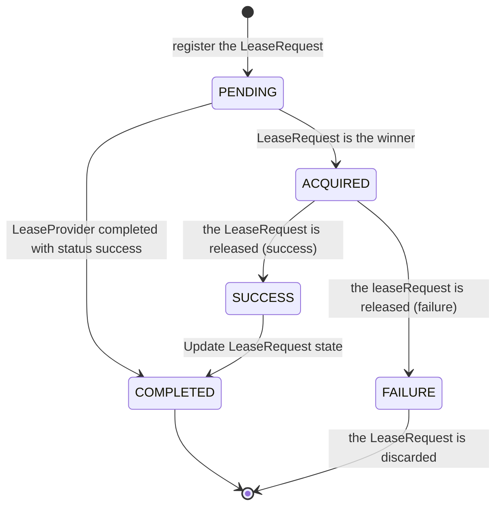
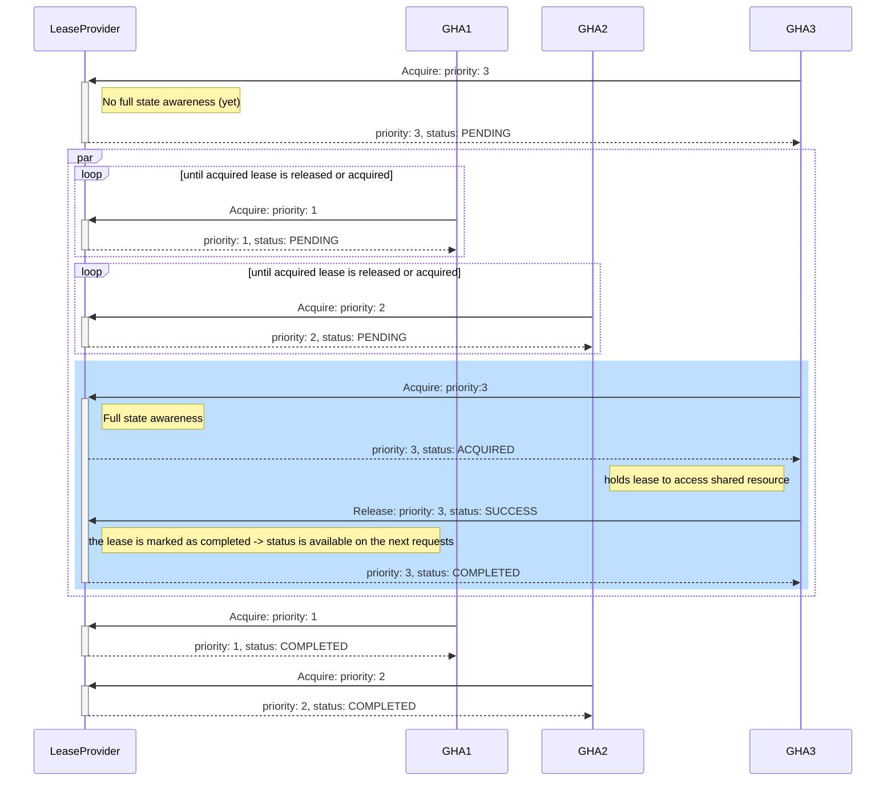
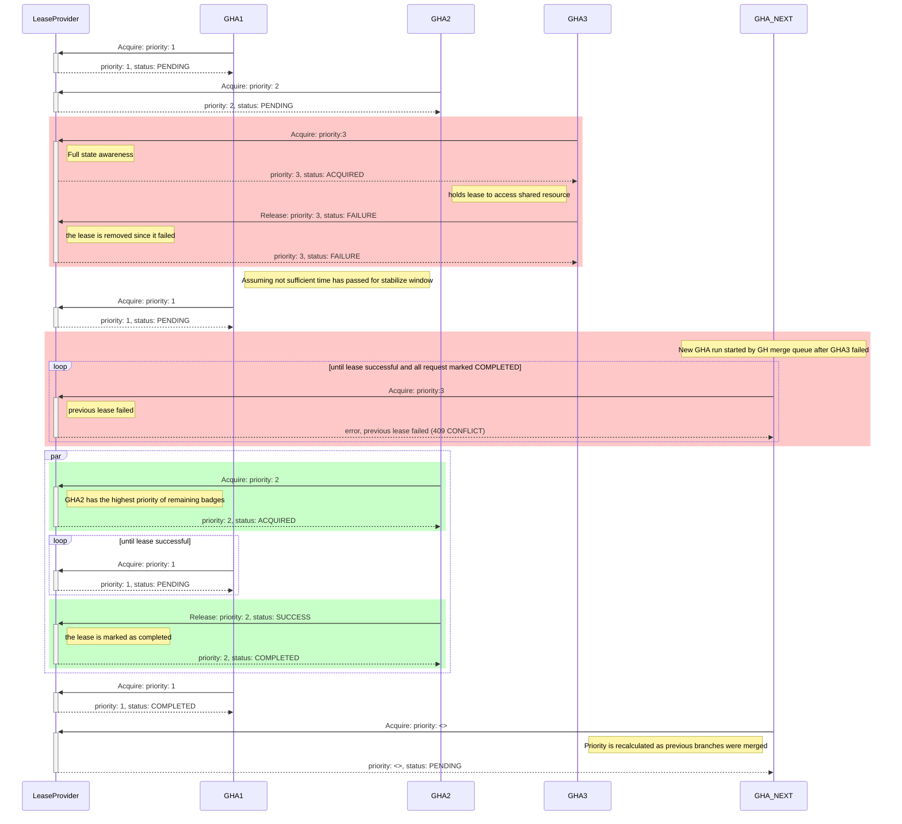

# mq-lease-service
> Add a funnel for shared resources on the Github Merge Queue.

If you want to use the github merge-queue feature and have a shared resource that can only be accessed by one process at a time (e.g. deploying a staging environment and running tests), this service/action is for you.
It allows actions running as part of a merge group to get a mutex/lease on a shared resource, ensuring that only one action can access the resource at a time. Here, it takes in the priority of the action based on the number of commits ahead of the base branch and ensures that the highest priority action gets the lease.
After releasign the mutex/lease (and by the nature of the merge queue combining commits), a positive outcome is propagated forward to action runs with a lower priority, or, on a failure, the lease is released and the next action with the highest priority gets the lease.

## Contributing

You will need Go `>= 1.19`

### Install the pre-commit hook
```shell
pre-commit install
```

Pre-commit requirements:
- `golangci-lint`

### Useful commands
```shell
make lint
make test
make build
make run-server # to run the server
```

## Components

### Github Action
The Github Action component of this repo interacts with the LeaseProvider and determines the priority of each run based on the commits ahead of the base.
It has two stages:
1. Acquiring a lease
2. Releasing a lease when (1) has been successful, reporting the Github action job status

An example workflow can look like this:
```yaml
on:
  # Trigger on PRs; here we just skip
  pull_request:
    branches: [ main ]
  # Trigger on the merge group event
  merge_group:
    branches: [ main ]
    types: [ checks_requested ]

jobs:
  access-shared-resource:
    runs-on: ubuntu-latest
    if: ${{ github.event_name == 'merge_group' }}
    steps:
    - name: Checkout Plugin Repository
      uses: actions/checkout@v3
    - name: acquire lease
      id: acquire_lease
      uses: ankorstore/mq-lease-service@main
      with:
        endpoint: https://your.lease.service.com
        # auth: "" Optional: Authorization header value

    - name: sleep
      # Only perform github actions when this run acquired the lease
      if: ${{ steps.acquire_lease.outputs.result == 'acquired' }}
      run: |
        echo "Do some stuff"

    - name: release lease
      id: release
      uses: ankorstore/mq-lease-service@main
      if: always()  # always run this step to ensure we don't leave the lease-service in a dirty state
      with:
        endpoint: https://your.lease.service.com
        release_with_status: ${{ job.status }}
        # auth: "" Optional: Authorization header value
```

### LeaseProvider
The LeaseProvider is a server that provides the ability to manage distributed leases among multiple github action runs, letting the highest priority run _win_ the lease. This process is helpful when there are multiple runs running that need access to a shared resource. It allows them to agree on the _winner_ of a race for the resource, and subsequently provide the _winner_ with a lease until it is released.
Depending on the release status (success/failure), the lease is completed and confirmation is awaited or the request from the failing lease is discarded and the process restarts.

It exposes the following endpoints:
- GET `/healthz` Kubernetes health endpoint
- GET `/readyz` Kubernetes readiness endpoint
- GET `/metrics` Prometheus metric endpoint
- POST `/:owner/:repo/:baseRef/acquire` for aquiring a lease (poll until status is acquired or completed)
- POST `/:owner/:repo/:baseRef/release` for releasing a lease (the winnder informs the LeaseProvider with the end result)

The payload and response (_LeaseRequest_) is encoded as JSON and follows this scheme:
```jsonnet
{
  "head_sha": "...",
  "priority" 0,
  "status": "(optional) pending|acquired|failure|success|completed"
}
```

Configuration options:
- `--port` (8080)
- `--stabilisation-window` (5m) - time to wait before giving out a lease without all expected PRs being in the merge queue
- `--ttl` (30s) - time to wait before considering an acquire interest being stale
- `--expected-build-count` (4) - number of parallel builds to be expected for a given merge group

#### STM of status transformations
> Note: this is the STM of a LeaseRequest, the LeaseProvider is a bit more complicated but should be a STM at the very end



#### Sequence diagrams
> Note: assuming 3 parallel builds

**Successful run:**


**Sequence diagram of a failure with a new build coming in right away**

> :warning: I see a potential conflict here. It could be that GHA1 or GHA2 causes the failure of GHA3, we might not want to accept new LeaseRequests but handle priority across remaining ones

> Note: Expecting full status of 3 parallel builds and a new build immediately starting after the last one failed (GHA3). Also, this sequence diagram does not cover any parallel calls from github actions.




