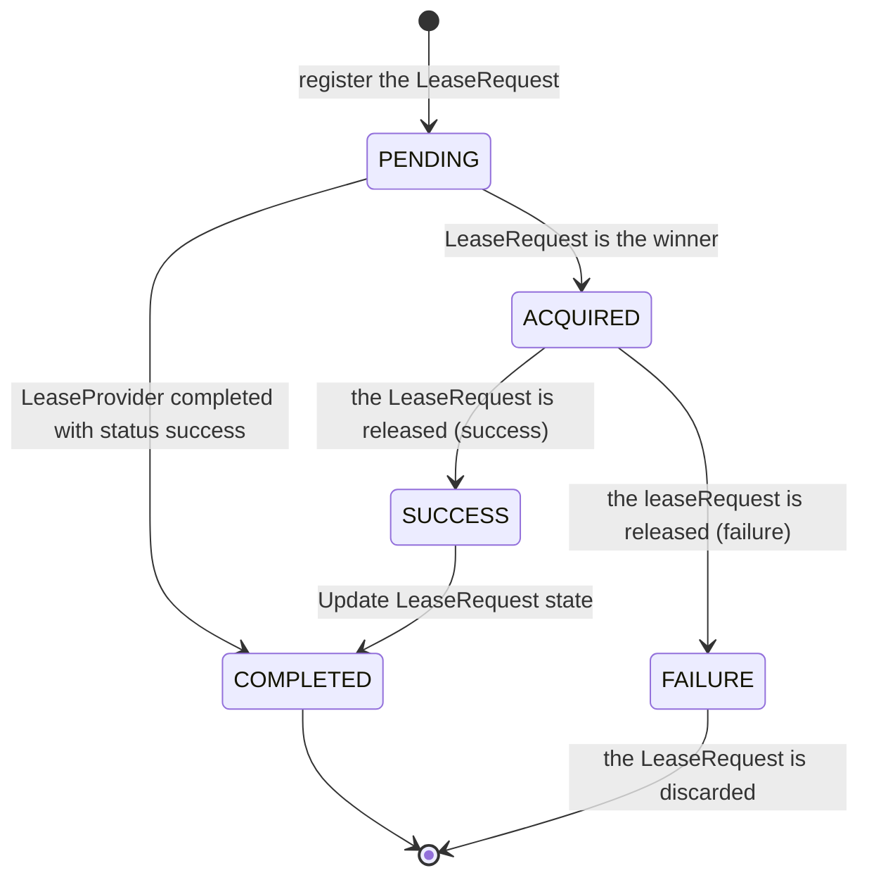
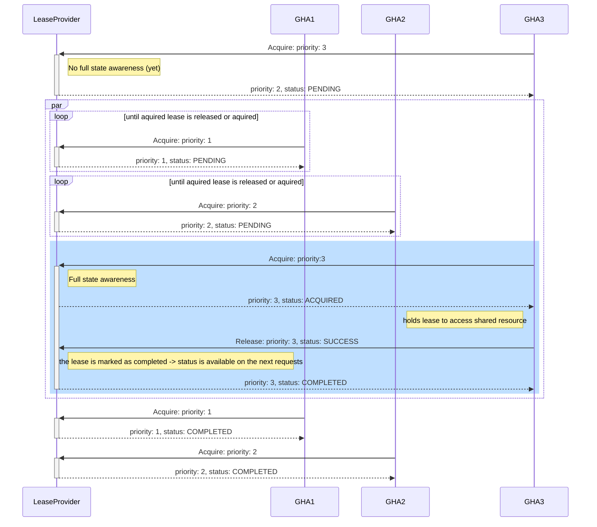
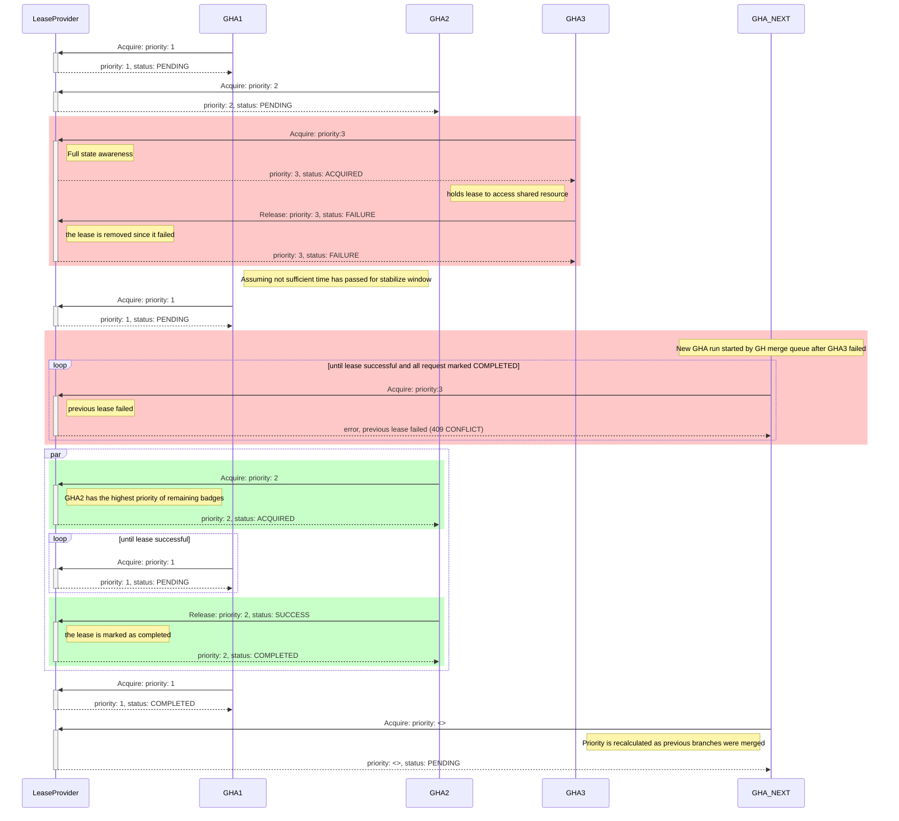

# gh-action-mq-lease-service
> A priority mutex with stabilisation window and TTLs, designed to work with the Github MergeQueue accessing a shared resource

## Components

### LeaseProvider
The LeaseProvider is a server that provides the ability to manage distributed leases among multiple github action runs, letting the highest priority run _win_ the lease. This process is helpful when there are multiple runs running that need access to a shared resource. It allows them to agree on the _winner_ of a race for the resource, and subsequently provide the _winner_ with a lease until it is released.
Depending on the release status (success/failure), the lease is completed and confirmation is awaited or the request from the failing lease is discarded and the process restarts.

It exposes the following endpoints:
- GET `/healthz` Kubernetes health endpoint
- GET `/readyz` Kubernetes readiness endpoint
- GET `/metrics` Prometheus metric endpoint
- POST `/:owner/:repo/:baseRef/aquire` for aquiring a lease (poll until status is aquired or completed)
- POST `/:owner/:repo/:baseRef/release` for releasing a lease (the winnder informs the LeaseProvider with the end result)

The payload and response (_LeaseRequest_) is encoded as JSON and follows this scheme:
```jsonnet
{
  "head_sha": "...",
  "priority" 0,
  "status": "(optional) pending|aquired|failure|success|completed"
}
```

Configuration options:
- `--port` (8080)
- `--stabilisation-window` (5m) - time to wait before giving out a lease without all expected PRs being in the merge queue
- `--ttl` (30s) - time to wait before considering an aquire interest being stale
- `--expected-build-count` (4) - number of parallel builds to be expected for a given merge group

#### STM of status transformations
> Note: this is the STM of a LeaseRequest, the LeaseProvider is a bit more complicated but should be a STM at the very end



#### Sequence diagrams
> Note: assuming 3 parallel builds

**Successful run:**


**Sequence diagram of a failure with a new build coming in right away**

> :warning: I see a potential conflict here. It could be that GHA1 or GHA2 causes the failure of GHA3, we might not want to accept new LeaseRequests but handle priority across remaining ones

> Note: Expecting full status of 3 parallel builds and a new build immediately starting after the last one failed (GHA3). Also, this sequence diagram does not cover any parallel calls from github actions.




### GithubAction
> :warning: WIP
The GithubAction component of this repo interacts with the LeaseProvider and determines the priority of each run based on the commits ahead of the baseRef.