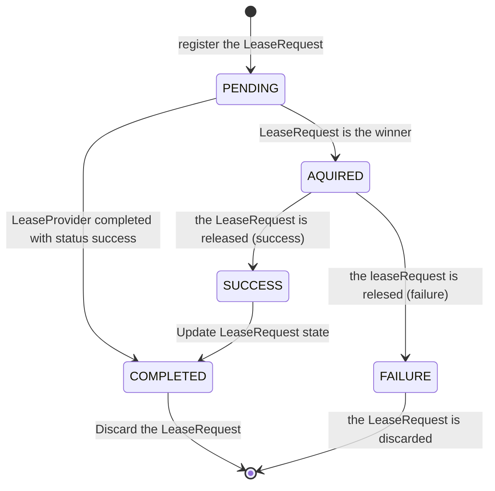

# gh-action-mq-lease-service
> A priority mutex with stabilisation window and TTLs, designed to work with the Github MergeQueue accessing a shared resource

## Components

### LeaseProvider
The LeaseProvider is a server that provides the ability to manage distributed leases among multiple github action runs, letting the highest priority run _win_ the lease. This process is helpful when there are multiple runs running that need access to a shared resource. It allows them to agree on the _winner_ of a race for the resource, and subsequently provide the _winner_ with a lease until it is released.
Depending on the release status (success/failure), the lease is completed and confirmation is awaited or the request from the failing lease is discarded and the process restarts.

It exposes two endpoints:
- POST `/:owner/:repo/:baseRef/aquire` for aquiring a lease (poll until status is aquired or completed)
- POST `/:owner/:repo/:baseRef/release` for releasing a lease (the winnder informs the LeaseProvider with the end result)

The payload and response (_LeaseRequest_) is encoded as JSON and follows this scheme:
```jsonnet
{
  "head_sha": "...",
  "priority" 0,
  "status": "(optional) pending|aquired|failure|success|completed"
}
```

#### STM of status transformations


#### Sequence diagram of a successful run
> :warning: WIP
```mermaid


```

### GithubAction
> :warning: WIP
The GithubAction component of this repo interacts with the LeaseProvider and determines the priority of each run based on the commits ahead of the baseRef.